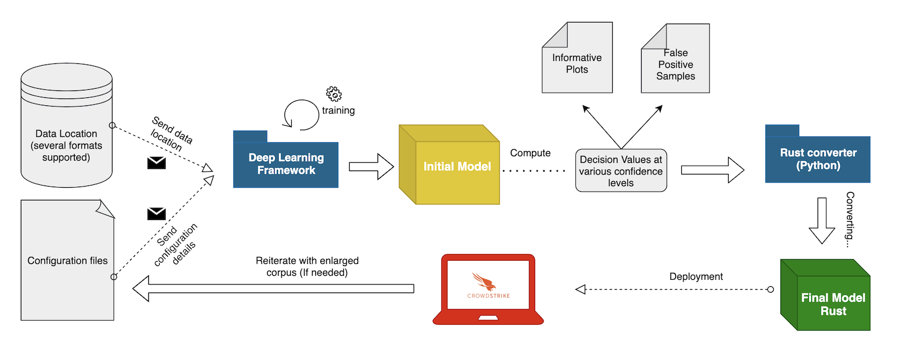
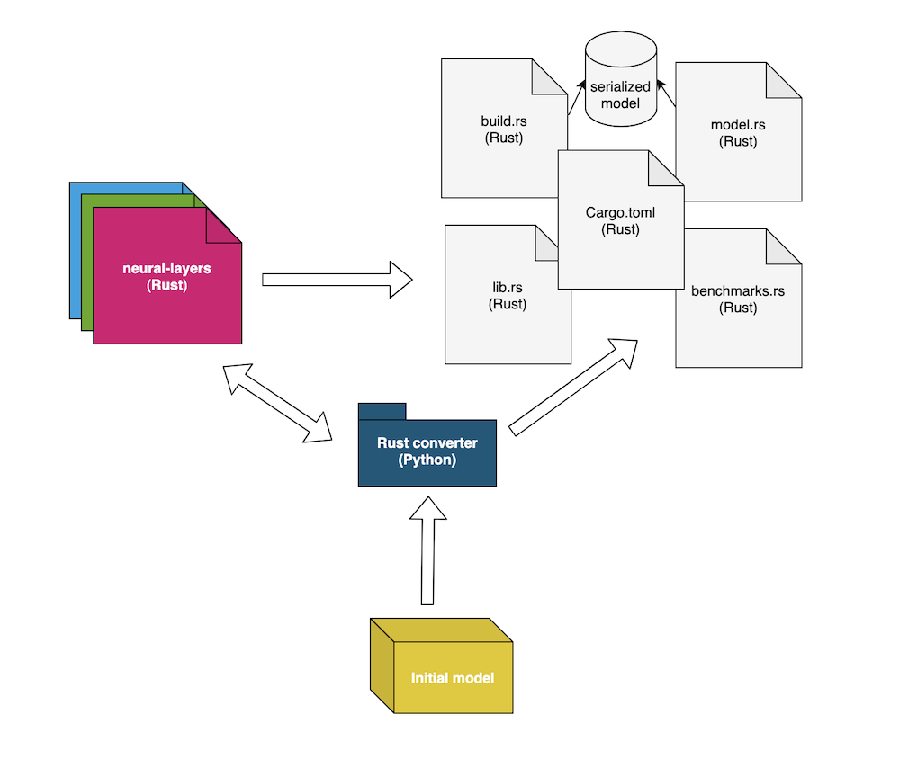
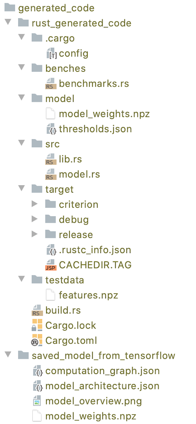

# TensorFlow to Rust package

## Special thanks to `Marian Radu` for his support during the development of the package

## Training Workflow

<br/>

## General Information


<br/>

A Python package that converts a TensorFlow model (.pb or .h5 format) into pure Rust code.
This package is dependent on [`tf-layers`](https://github.com/CrowdStrike/tf-layers) (Rust):

Currently, this package supports models that contain the following layers (the layers number is expected to grow in the future with the addition of further architectures):
* InputLayer - input layer. For further information check: https://www.tensorflow.org/api_docs/python/tf/keras/layers/InputLayer
* Multiply - multiply layer. For further information check: https://www.tensorflow.org/api_docs/python/tf/keras/layers/Multiply
* Reshape - reshape layer. For further information check: https://www.tensorflow.org/api_docs/python/tf/keras/layers/Reshape
* Conv1D - 1D convolutional layer. For further information check: https://www.tensorflow.org/api_docs/python/tf/keras/layers/Conv1D
* Embedding - embedding layer. For further information check: https://www.tensorflow.org/api_docs/python/tf/keras/layers/Embedding
* Dense - dense layer. For further information check: https://www.tensorflow.org/api_docs/python/tf/keras/layers/Dense
* Flatten - flatten layer. For further information check: https://www.tensorflow.org/api_docs/python/tf/keras/layers/Flatten
* Concatenate - concatenate layer. For further information check: https://www.tensorflow.org/api_docs/python/tf/keras/layers/Concatenate
* GlobalAveragePooling - global average pooling layer. For further information check: https://www.tensorflow.org/api_docs/python/tf/keras/layers/GlobalAveragePooling1D
* MaxPooling - maxpooling layer. For further information check: https://www.tensorflow.org/api_docs/python/tf/keras/layers/MaxPool1D
* AveragePooling - averagepooling layer. For further information check: https://www.tensorflow.org/api_docs/python/tf/keras/layers/AveragePooling1D
* BatchNormalization - batchnormalization layer. For further information check: https://www.tensorflow.org/api_docs/python/tf/keras/layers/BatchNormalization
* Add - addition layer.
* Mean - mean layer over a specified axis.
* Activation - different types of activation supported (can be used as an independet layer or inside different NN layers such as Dense, Conv1D, etc). Support available for:
	* Linear(Identity)
	* Relu
	* ThresholdedRelu
	* Selu
	* Sigmoid
	* Softmax
	* SoftPlus
	* SoftSign
	* Tanh
* `Note1`: Some layers might not have all the functionalities from TensorFlow implemented.
* `Note2`: It is mandatory to use an `InputLayer` for each input that the model expects. It is also mandatory that `InputLayer's` dtype be exactly specified (default is `float`).
For instance, if an `InputLayer` is followed by an `EmbeddingLayer`, then the type of that particular `InputLayer` must be set to int - e.g. "int64".
Another requirement is to have the `output_shape` of each layer specified (the only unspecified size should be about the batch size).
This is usually done by setting the `input_shape` parameter when initializing the `InputLayer`.

<br/>

## Requirements

This project targets the Python 3.8 interpreter. You will need to install
`graphviz` using your system dependency manager of choice. On macOS, this can be
done with the command:

```bash
brew install graphviz
```

Here are the python package requirements for this project:

```
argparse==1.4.0
nose==1.3.7
numpy==1.23.4
pydot==1.4.2
scikit-learn==1.1.3
tensorflow==2.8.3
```

To set up a virtualenv execute the following commands in the project root:

```bash
python -m venv .venv
source .venv/bin/activate
pip install --upgrade pip
pip install -r requirements.txt
```

<br/>

## Configuration arguments

#### --path_to_tf_model
The path (relative or absolute) to the TensorFlow model to be converted into pure Rust code. It is mandatory.

#### --path_to_save
The path (relative or absolute) where to save the generated Rust code. It is mandatory.

#### --model_name
The model name. A struct named <model_name>Model will be created in Rust. E.g model_name = Mnist => Mnist. It is mandatory.

#### --binary_classification
Set this flag to true/false whether the model is a binary classifier or not (false for regression or multiclass classifiers). Default is true.

#### --enable_inplace
Set this flag to true/false whether you want the model written in Rust to use in-place operations whenever possible (in `predict_from_array` function). Default is true.

#### --enable_memdrop
Set this flag to true/false whether you want the model written in Rust to free the memory of intermediate layers results as soon as possible (instead of the actual ending of `predict_from_array` function). Default is true.

#### --path_to_fv
Set the path to a npz array containing the FV for a bunch of samples. The keys for the arrays should match the keys from perform_fx from NeuralBrain (which must be the same as the InputLayers' names when building the model). Also, the expected predictions should be saved as an array in `features.npz` by the key `predictions`. This flag is optional.

<br/>

## Output Files



* saved_model_from_tensorflow:
    * computation_graph.json: The computational dependencies.
    * model_architecture.json: Different parameters for the actual NN layers (stride, pool_size, kernel_size, activation type, etc).
    * model_overview.png: A graph image describing the model.
    * model_weights.npz: model's weights.
* rust_generated_code:
    * build.rs: A Rust build file used in serialising the model by reading from model_weights.npz
    * Cargo.toml: the place where all the imports are specified (and many more).
* rust_generated_code/model:
    * model_weights.npz: model weights saved in a format that can be used by Rust.
    * thresholds.json: the thresholds for `low`, `bottom`, `medium`, `high` confidence levels.
* rust_generated_code/src:
    * model.rs: A Rust structure encapsulating all the logic behind prediction.
    * lib.rs: the file containing the tests.
* rust_generated_code/testdata:
    * features.npz: the features to be passed to the model (1D numpy ndarray).
* rust_generated_code/benches:
    * benchmarks.rs: the file in charge of benchmarks.

<br/>

#### In order to asses the performance of the model, run `cargo bench`
#### In order to test the predictions and see the translation went as expected, run `cargo test`
#### Note: all this commands need be executed on `rust_generated_code/` directory.

<br/>

## Usage

To convert a TensorFlow model use a command-line like the followings:

```bash
python3 main.py \
--path_to_tf_model tests/data/mnist/tf_model/ \
--path_to_save tests/data/generated_classifiers/mnist \
--model_name MNist \
--binary_classification True \
--enable_inplace True \
--enable_memdrop True \
--path_to_fv tests/data/mnist/features.npz # for testing purposes, optional

```

## Converting `.h5` models to `.pb`

```python
from tensorflow.keras.models import load_model, save_model
# Note that models will have different metrics also saved with the models and expect the implementations for these
# metrics.
# We have these implemented in utils/scoring_metrics.py but these are not used, and we can also provide None.
model = load_model('new_model.h5', custom_objects={'tpr': None, 'tnr': None, 'auc': None})
save_model(model=model, filepath='tf_model/', include_optimizer=False)
```


## Running the tests

Until we'll properly set up tox, we'll be running nosetests, because it's easier to debug and set up.
At the time we'll migrate towards Docker-ising this, we'll also switch to tox (this should not pose any difficulties).

We have currently set up integration tests, which do the following:

* Given model artifacts, generate Rust code
* Check that the Rust code is the same code to what we expect to be generated
* Compile the Rust code and see that all tests pass
    * Tests take in FVs and the DVs generated by the Tensorflow model
    * We check that inference with the Rust model yields the same results as the initial Tensorflow model

Run the integration tests using the following command (note that `-s` and `--verbose` are there for debugging purposes):

```bash
nosetests -s --verbose tests/test_integration.py
```

## Next steps

After everything runs smoothly with your model, please add artifacts and a new test for it.
